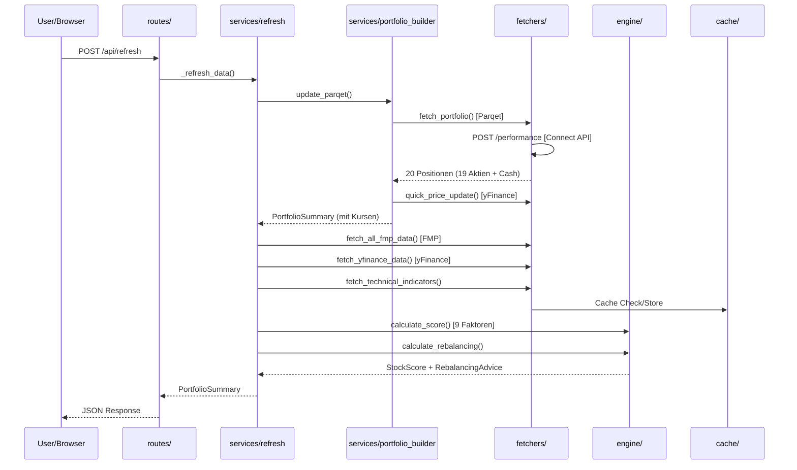
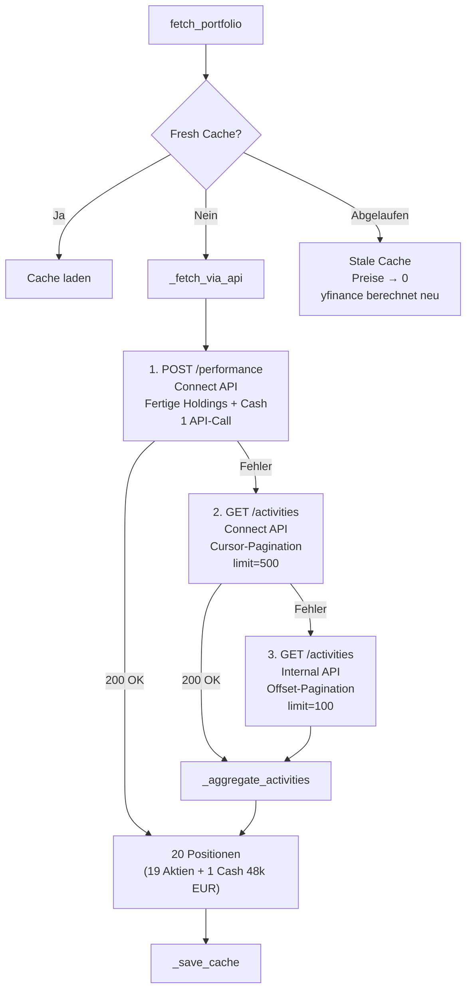

# FinanzBro – Architektur

## Übersicht

FinanzBro ist ein intelligentes Aktienportfolio-Dashboard mit automatisierter Multi-Faktor-Analyse.  
Läuft lokal (Python) und auf Google Cloud Run (Docker).

```
FinanzBro/
├── main.py                 # FastAPI App + Lifespan + Scheduler
├── config.py               # Zentrale Konfiguration (.env)
├── models.py               # Pydantic Datenmodelle
├── state.py                # Globaler State + yFinance Aliases
├── cache_manager.py        # Thread-safe Memory+Disk Cache
│
├── routes/
│   ├── portfolio.py        # GET /api/portfolio, /api/stock/{ticker}
│   ├── refresh.py          # POST /api/refresh, /api/refresh/prices
│   ├── analysis.py         # POST /api/analysis/run, GET /api/analysis/latest
│   ├── analytics.py        # Dividenden, Risiko, Korrelation, Benchmark
│   ├── parqet_oauth.py     # GET /api/parqet/authorize + /callback (OAuth2 PKCE)
│   └── streaming.py        # GET /api/prices/stream (SSE)
│
├── services/
│   ├── portfolio_builder.py # Leichtgewichtiges Parqet+yFinance Update
│   ├── refresh.py          # Voller Refresh (alle Datenquellen)
│   ├── currency_converter.py # Zentrale EUR-Konvertierung
│   ├── ai_agent.py         # Gemini AI + Telegram Reports
│   ├── telegram.py         # Telegram Bot API
│   └── scheduler.py        # APScheduler Jobs
│
├── engine/
│   ├── scorer.py           # 9-Faktor Scoring Engine
│   ├── rebalancer.py       # Portfolio-Rebalancing
│   ├── analysis.py         # Analyse-Reports + Score-Historie
│   ├── analytics.py        # Korrelation, Risiko, Dividenden
│   └── history.py          # Portfolio-Snapshots (365 Tage)
│
├── fetchers/
│   ├── parqet.py           # Parqet Connect API (Performance + Activities)
│   ├── parqet_auth.py      # OAuth2 Token-Management (PKCE, Refresh, Firefox)
│   ├── fmp.py              # Financial Modeling Prep API
│   ├── yfinance_data.py    # yFinance (Batch-Download in 5er-Chunks)
│   ├── finnhub_ws.py       # Finnhub WebSocket (Echtzeit US)
│   ├── technical.py        # RSI, SMA, MACD Berechnung
│   ├── fear_greed.py       # CNN Fear & Greed Index
│   ├── currency.py         # EUR/USD/DKK/GBP Wechselkurse
│   └── demo_data.py        # Synthetische Demo-Daten
│
├── docs/                   # Dokumentation + API-Referenz
├── static/                 # Frontend (HTML/JS/CSS)
├── scripts/                # Deploy- und Token-Helper
└── tests/                  # 223 pytest Tests
```

## Datenfluss



## Parqet API-Anbindung

Drei Datenquellen in Prioritätsreihenfolge:



### API-Endpunkte (Parqet Connect API)

| Endpoint | Methode | Nutzung |
|----------|---------|---------|
| `/performance` | POST | **Primär** — Fertige Holdings mit Positionen |
| `/portfolios/{id}/activities` | GET | Fallback — Activities mit Cursor-Pagination |
| `/portfolios` | GET | Debug — Portfolio-Liste bei Fehlern |
| `/user` | GET | Nicht genutzt (Token-Validierung möglich) |
| `/oauth2/authorize` | GET | OAuth2 PKCE Login |
| `/oauth2/token` | POST | Token-Refresh |

> **Doku:** Vollständige API-Referenz unter `docs/Parqet API/`

### Performance API Response (POST /performance)

```json
{
  "holdings": [{
    "asset": {"type": "security", "isin": "DE0007037129", "name": "RWE"},
    "position": {"shares": 379, "purchasePrice": 34.73, "currentPrice": 53.36, "currentValue": 20260, "isSold": false},
    "quote": {"currency": "EUR", "price": 53.36, "fx": {"rate": 1, "originalCurrency": "EUR"}},
    "performance": {"dividends": {"inInterval": {"gainGross": 1234}}, "kpis": {"inInterval": {"xirr": 0.15}}}
  }],
  "performance": {"valuation": {"atIntervalEnd": 263315}}
}
```

### Token-Renewal (parqet_auth.py)

1. Gespeicherter Token prüfen (JWT `exp` dekodieren)
2. OAuth2 Refresh (`refresh_token` → `connect.parqet.com/oauth2/token`)
3. Firefox-Cookie Fallback (nur lokal: `parqet-access-token`)
4. Nach erfolgreichem Callback → Tokens in Cloud Run Env-Vars persistieren

## Caching-Strategie

| Cache-Typ | Verhalten | Beispiele |
|-----------|-----------|-----------|
| **Volatile** | Beim Start gelöscht | FMP, yFinance, Fear&Greed |
| **Persistent** | Bleibt zwischen Restarts | Parqet, Currency |
| **Stale Cache** | Ohne TTL als Fallback | Parqet-Positionen (Cloud Run) |

## Cloud Run Deployment

```
Docker Image (python:3.12-slim)
  ├── App-Code
  ├── cache/ (eingebacken → Stale Cache Fallback)
  └── Env-Vars (API Keys, OAuth2 Tokens)

Konfiguration:
  Memory: 512 Mi
  CPU: 1
  Min Instances: 0 (Scale to Zero)
  Max Instances: 1
  Region: europe-west1
```

### Deployment-Ablauf

1. Tests lokal ausführen (`pytest tests/`)
2. `gcloud run deploy finanzbro --source . --region europe-west1 --update-env-vars ...`
3. OAuth2 re-autorisieren: `/api/parqet/authorize` aufrufen
4. Refresh triggern: `POST /api/refresh`

> **Wichtig:** `--update-env-vars` statt `--set-env-vars` verwenden, um bestehende API-Keys zu behalten!

### Scheduler (APScheduler auf Cloud Run)

| Job | Zeit | Funktion |
|-----|------|----------|
| Daily Refresh | `06:00` | Voller Daten-Refresh |
| Price Update | alle `30 min` | Quick-Price-Refresh |
| AI Agent + Telegram | `15:50` | KI-Analyse + Report |
